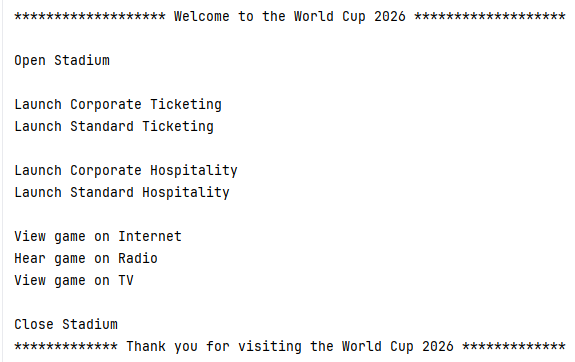

# python-exercise-world-cup

To practice creating modules and packages in Python.  

## Task
The exercise is to create the structure for a new football simulation game for the World Cup 2026. The game will simulate a real match day experience at the World Cup including opening a stadium, selling tickets, offering hospitality and of course, watching the football game.  
The task is to start creating the various modules that are required and to put them into a package.   

## Required directory hierarchy

```
python-exercise-world-cup
    -py
     -packages
      -worldcup
       -hospitality
        -corporate.py
        -standard.py
       -media
        -internet.py
        -radio.py
        -tv.py
       -stadia
        -stadium_manager.py
       -ticketing
        -corporate.py
        -standard.py 
       -__init__.py
     -progs
      -main.py
```
## Screenshot



## Packages

| Folder  	      | Module  	             | Function                              |
|---------------|----------------------|---------------------------------------|
| hospitality  	 | corporate.py  	       | def corporate():                      |
|               |                      | return "Launch Corporate Hospitality" |
| 	              | standard.py  	        | def standard():                       |
|               |                      | return "Launch Standard Hospitality"  |
| 	              | 	                     |                                       |
| media  	       | internet.py  	        | def view_game():                      |
|               |                      | return "View game on Internet"        |
| 	              | radio.py  	           | def hear_game():                      |
|               |                      | return "Hear game on Radio"           |
| 	              | tv.py  	              | def view_game():                      |
|               |                      | return "View game on TV"              |
| 	              | 	                     |                                       |
| stadia  	      | stadium_manager.py  	 | def open():                           |
|               |                      | return "Open Stadium"                 |
| 	              | stadium_manager.py  	 | def close():                          |
|               |                      | return "Close Stadium"                |
| 	              | 	                     |                                       |
| ticketing  	   | corporate.py  	       | def corporate():                      |
|               |                      | return "Launch Corporate Ticketing"   |
| 	              | standard.py  	        | def standard():                       |
|               |                      | return "Launch Standard Ticketing"    |


## Programs
| Folder  	      | Program  	 | Function                                 |
|---------------|-----------|------------------------------------------|
| progs  	      | main.py  	 | Append packages path and display options |


